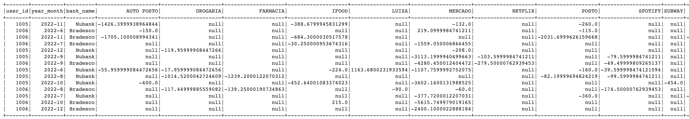
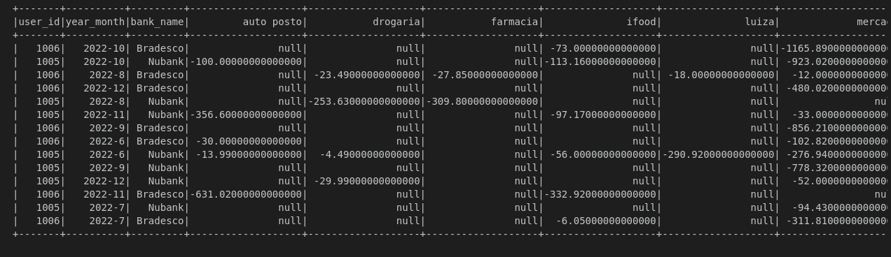

# data_pipeline_mle
Case para o picpay para realizar tratamento de dados em datasets de transações bancárias.

# O problema 

**O Problema**

O **Minhas Finanças** é um produto no PicPay para organizar e comparar os gastos financeiros dos nossos usuários. Desta forma, o time de MLOPS do PicPay tem o objetivo de disponibilizar uma base de dados tratada para ser analisada pelos Cientistas de dados.

O **objetivo** desse exercício é realizar o tratamento de dados para analise das das transações que foram categorizadas.

De forma objetiva, o seu output final deve ser uma tabela conforme a imagem abaixo.

# Montando a tabela 

1. Leitura dos dados brutos
2. Verificação de valores nulos 
3. Tratamento de strings: 
   - Remover os espaços do inicio e final das palavras (método `trim`)
   - Deixar as letras das variáveis minusculas `transaction_name_raw` e `transaction_name_treated`.
   - Substituir os valores de `,` para `.` da variável `transaction_amount`.
   - Concatenar as informações de `year`e `month`.
   - Recolher as informações de `bank_name` através do join de `transaction.csv` com `bank_dim.csv`.

4. Mudando dtypes das variáveis:
    - BIGINT: `transaction_id`
    - INT: `user_id`
    - NUMERIC(20,14): `transaction_amount`
    - DATE: `year_month` (Aqui aplicamos o `date_format` para deixar os dados da forma `y-m`)
    - STRINGS: `transaction_name_raw` e `transaction_name_treated`.

5. Montar a tabela
   - Agrupar os dados de `user_id`, `bank_name` e `yaer_month`.
   - Pivotar a tabela com a coluna `transaction_name_treated`.
   - Somar os valores dos dados da coluna `transaction_amount`.

# Resultado obtido

# Como executar esse projeto?

Execute o comando:

`conda create -f environment.yml`